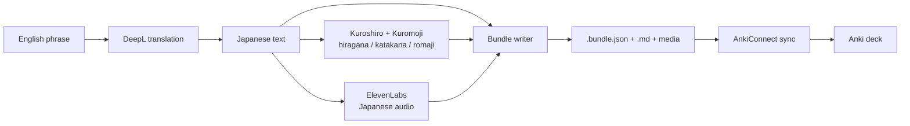

# Obsidian Anki Card Generator Japanese

Desktop-only Obsidian plugin for turning an English phrase into a reusable Japanese study bundle.

## What it does

- Translates English to Japanese with DeepL.
- Generates hiragana, katakana, and spaced romaji locally with Kuroshiro + Kuromoji.
- Optionally generates Japanese audio with ElevenLabs.
- Writes export-friendly bundle files to a directory you choose each time.
- Can optionally sync generated Front/Back cards into a running Anki desktop app through AnkiConnect.
- Can also export an existing folder of `.bundle.json` files to Anki as a separate step.
- Keeps filesystem storage separate from the eventual Anki deck destination.
- Fetches available ElevenLabs voices into a settings dropdown.
- Uses Anki's built-in `Basic (and reversed card)` note type when syncing.

## Flow



## Bundle output

For an input phrase such as `Where is the station?`, the plugin writes:

- `where-is-the-station.md`
- `where-is-the-station.bundle.json`
- `media/where-is-the-station-ja.mp3` when audio is enabled

The JSON sidecar stores the structured data we can later map into:

- AnkiConnect sync
- CSV export
- packaged Anki imports

`deckName` is optional metadata, not part of the storage layout.

## Settings

- DeepL API key
- AnkiConnect URL
- ElevenLabs API key
- ElevenLabs voice ID
- ElevenLabs model/output defaults
- Romaji system
- Default audio toggle
- Default Anki sync toggle

The output directory is intentionally chosen in the modal for each run.
The deck name is optional unless you enable Anki sync in the modal. It is never used as a filesystem destination.

## Commands

- `Translator: Generate Japanese Anki Bundle`
- `Translator: Export Japanese Anki bundles to Anki`

The export command reads every `.bundle.json` file in the selected folder and pushes them to a running AnkiConnect instance.

## Development

```bash
npm install
npm run build
```

The build copies Kuromoji dictionary files into `./dict`, which the plugin uses at runtime for reading conversion.

## Local install

Copy these artifacts into your vault at `.obsidian/plugins/obsidian-anki-card-generator-japanese/`:

- `main.js`
- `manifest.json`
- `dict/`
- `data.json` if you want to preserve local settings on one machine

This plugin is safest to run as a copied build artifact rather than a symlinked repo folder, because Obsidian writes plugin settings into `data.json`.

## Install via BRAT

1. Install the [BRAT plugin](https://github.com/TfTHacker/obsidian42-brat)
2. In BRAT, choose `Add a beta plugin`
3. Enter this repo: `Itsindigo/obsidian-anki-card-generator-japanese`
4. Enable `Translator` in Obsidian community plugins
